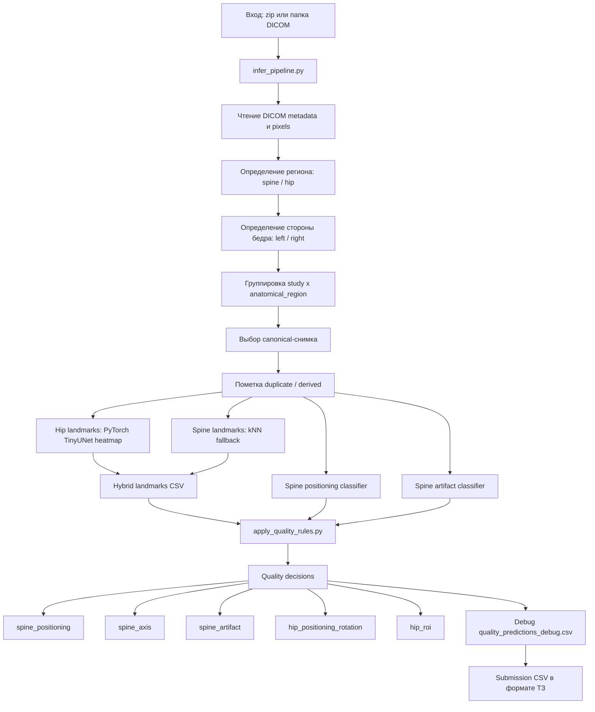

# End-to-End Pipeline Scheme

Документ для обсуждения общей схемы решения: от входного архива DICOM до итоговой таблицы качества.

## Цель

На вход подается zip-архив или папка с DICOM-исследованиями. На выходе нужна таблица, где для каждого изображения указано:

| Поле | Что пишем |
| --- | --- |
| `path_to_study` | путь к исследованию или файлу |
| `study_uid` | идентификатор исследования из DICOM |
| `image_uid` | идентификатор изображения из DICOM |
| `anatomical_region` | `spine`, `left_hip`, `right_hip`, `unknown` |
| `quality_class` | `0` - качественное, `1` - есть нарушение |
| `violation_type` | тип или список нарушений |
| `processing_status` | `Success` / `Failure` |
| `time_of_processing` | время обработки в секундах |

Единый запуск пишет финальный CSV через `scripts/run_full_inference.py`; внутренний debug-выход остается в `quality_predictions_debug.csv`.

## Общая схема



## 0. One-command Inference

Текущая единая точка запуска:

```bash
uv run python scripts/run_full_inference.py \
  --input examples/example_input.zip \
  --out-csv artifacts/submission.csv
```

Скрипт запускает все внутренние шаги пайплайна, пишет debug CSV в `artifacts/full_inference/` и финальный CSV с колонками ТЗ:

```text
path_to_study
study_uid
image_uid
anatomical_region
quality_class
violation_type
processing_status
time_of_processing
```

`processing_status` в финальном CSV приводится к `Success` / `Failure`; подробный статус и диагностические признаки остаются в debug CSV.

## 1. Чтение входных данных

Скрипт:

```bash
uv run python scripts/infer_pipeline.py \
  --input examples/example_input.zip \
  --out-csv artifacts/inference_skeleton.csv
```

Что делает:

- читает DICOM из zip-архива или папки;
- берет DICOM metadata: `StudyInstanceUID`, `SeriesInstanceUID`, `SOPInstanceUID`, `Rows`, `Columns`;
- рендерит DICOM в grayscale-изображение для CV-моделей;
- создает строку на каждый DICOM.

## 2. Определение anatomical_region

Если имя файла информативное:

- `ПОП`, `SPINE` -> `spine`;
- `ППОБ`, `RIGHT`, `RHIP` -> `right_hip`;
- `ЛПОБ`, `LEFT`, `LHIP` -> `left_hip`.

Если имя файла неинформативное, например `CR000000.dcm`, используется размер кадра:

```text
columns >= 295       -> spine
240 <= columns <= 290 -> hip_unknown_side
otherwise            -> unknown
```

Это эвристика под текущую выгрузку DXA. Она хорошо согласуется с текущими данными, но перед финальной сдачей желательно проверить на тестовом формате.

## 3. Определение стороны бедра

Сторона бедра определяется каскадом:

1. По имени файла: `ППОБ` / `RIGHT` / `RHIP` или `ЛПОБ` / `LEFT` / `LHIP`.
2. По DICOM-тегам: `ImageLaterality`, `Laterality`.
3. Если не получилось - template matching по пикселям.

Template matching:

- DICOM рендерится в grayscale;
- изображение уменьшается до фиксированного размера;
- яркость нормализуется;
- картинка сравнивается с усредненным шаблоном левого бедра и правого бедра;
- выбирается сторона, чей шаблон ближе по pixel distance.

Это не нейросеть, а простая CV-эвристика. На canonical train-бедрах текущая проверка дала примерно `150/152` правильных определений.

## 4. Canonical image и duplicate / derived

На финальном инференсе нужна строка на каждый DICOM, и качество считаем отдельно для каждого DICOM.

Группировка:

```text
study_key + anatomical_region
```

Внутри каждой группы выбирается один `canonical`-снимок по рангу:

```text
1. больше Rows * Columns
2. больше file_size
3. tie-breaker по Rows
```

Остальные изображения в той же группе помечаются как `duplicate_or_derived`, но из quality inference не исключаются.

Важно: сейчас это не pixel-level duplicate detection. Canonical/duplicate используются как debug/training признаки; качество не копируется с canonical.

## 5. Landmark inference

### 5.1. Hip landmarks: PyTorch heatmap

Скрипт:

```bash
uv run python scripts/predict_landmarks_heatmap.py \
  --input-csv artifacts/inference_skeleton.csv \
  --dicom-input examples/example_input.zip \
  --out-csv artifacts/inference_landmark_predictions_heatmap.csv
```

Модель:

- `TinyUNet`;
- вход: grayscale image;
- encoder-decoder CNN;
- выход: heatmap на каждую точку;
- loss: weighted heatmap MSE;
- дополнительно есть geometry loss для трех точек малого вертела;
- постпроцессинг удерживает точки малого вертела в анатомически более разумной конфигурации.

Hip landmarks:

- `hip_greater_trochanter_top_edge` - верхний край большого вертела;
- `hip_greater_trochanter_lateral_edge` - боковой край большого вертела;
- `hip_lesser_trochanter_upper` - верх выпуклости малого вертела;
- `hip_lesser_trochanter_tip` - вершина малого вертела;
- `hip_lesser_trochanter_lower` - низ выпуклости малого вертела;
- `hip_ischium_edge` - край седалищной кости.

Текущая метрика hip heatmap на validation:

```text
mean error:   4.36 мм
median error: 1.99 мм
p90 error:    6.32 мм
```

### 5.2. Spine landmarks: kNN fallback

Скрипт:

```bash
uv run python scripts/predict_landmarks_knn.py \
  --input-csv artifacts/inference_skeleton.csv \
  --dicom-input examples/example_input.zip \
  --out-csv artifacts/inference_landmark_predictions_knn.csv
```

kNN работает так:

- изображение приводится к grayscale;
- resize до `96 x 96`;
- нормализация яркости;
- изображение превращается в вектор пикселей;
- ищутся `k=5` ближайших размеченных train-изображений того же региона;
- landmark берется как взвешенное среднее координат соседей;
- вес соседа: `1 / distance`.

Spine landmarks:

- `spine_th12_center`;
- `spine_l1_center`;
- `spine_l2_center`;
- `spine_l3_center`;
- `spine_l4_center`;
- `spine_l5_center`;
- `spine_left_iliac_crest`;
- `spine_right_iliac_crest`.

Почему kNN для spine: PyTorch heatmap для позвоночника сейчас дал плохую точность, поэтому в текущем гибриде spine landmarks оставлены через kNN.

### 5.3. Hybrid landmarks

Скрипт:

```bash
uv run python scripts/merge_landmark_predictions.py \
  --primary-csv artifacts/inference_landmark_predictions_heatmap.csv \
  --fallback-csv artifacts/inference_landmark_predictions_knn.csv \
  --out-csv artifacts/inference_landmark_predictions_hybrid.csv
```

Смысл гибрида:

```text
hip landmarks   -> PyTorch heatmap
spine landmarks -> kNN fallback
```

## 6. Spine classifiers

### 6.1. Spine positioning / подвздошные кости

Задача: определить, корректна ли укладка позвоночника по наличию нижней части изображения с подвздошными костями.

Скрипт обучения:

```bash
uv run python scripts/train_spine_classifier.py --task positioning --epochs 60 --batch-size 16 --balanced-positioning-val
uv run python scripts/train_spine_classifier.py --task positioning --epochs 60 --batch-size 16 --train-all
```

Данные:

- оригинальные spine-изображения;
- синтетические негативы: у нормальных spine-снимков обрезается низ так, чтобы убрать подвздошные кости;
- ручной review `artifacts/spine_positioning_dataset/manual_iliac_review.csv`: в обучение включены только строки `review_use_for_training=1`.

Модель:

- `SmallSpineCNN`;
- вход: `1 x 224 x 224`;
- Conv2d + BatchNorm + ReLU;
- MaxPool blocks;
- AdaptiveAvgPool;
- Dropout `0.25`;
- Linear на 1 logit;
- loss: `BCEWithLogitsLoss`;
- threshold для отчета обучения подбирается по balanced accuracy;
- calibration использует balanced holdout из оригинальных снимков `8 good / 8 bad` без пересечения `study_folder` с train;
- финальные веса обучены через `--train-all`, но боевой threshold оставлен с balanced validation-калибровки, чтобы не использовать in-sample threshold.

Боевой validation threshold:

```text
spine_positioning_prob_bad >= 0.780947 -> bad
```

Train-all sanity-check checkpoint threshold был `0.748786`, но в inference он не используется.

### 6.2. Spine artifact / артефакты

Задача: найти выраженные артефакты, сейчас основной практический пример - косточки бюстгальтера.

Скрипт обучения:

```bash
uv run python scripts/train_spine_classifier.py --task artifact --epochs 80 --batch-size 16
uv run python scripts/train_spine_classifier.py --task artifact --epochs 80 --batch-size 16 --train-all
```

Данные:

- оригинальные spine-изображения;
- augmentation для positive artifact: horizontal flip.

Модель такая же:

- `SmallSpineCNN`;
- вход: `1 x 224 x 224`;
- binary classifier;
- threshold для отчета обучения подбирается по balanced accuracy;
- финальные веса обучены через `--train-all`, но боевой threshold оставлен со старой validation-калибровки, чтобы не использовать in-sample threshold.

Боевой validation threshold:

```text
spine_artifact_prob_bad >= 0.381291 -> bad
```

Train-all sanity-check checkpoint threshold был `0.059970`, но в inference он не используется.

## 7. Quality rules

Скрипт:

```bash
uv run python scripts/apply_quality_rules.py \
  --inference-csv artifacts/inference_skeleton.csv \
  --landmarks-csv artifacts/inference_landmark_predictions_hybrid.csv \
  --spine-classifiers-csv artifacts/inference_spine_classifier_predictions.csv \
  --out-csv artifacts/quality_predictions_hybrid.csv \
  --model-name hybrid
```

### 7.1. Spine positioning

Сейчас берется из CNN-классификатора:

```text
spine_positioning_prob_bad >= 0.780947 -> violation_type includes spine_positioning
```

Смысл: плохая укладка, если не видны подвздошные кости / нижняя часть кадра некорректна.

### 7.2. Spine axis

Берутся центры видимых тел позвонков:

```text
Th12 / L1 / L2 / L3 / L4 / L5
```

Ось строится от верхнего видимого центра к нижнему видимому центру. Считается угол относительно вертикали изображения.

Текущий порог, подобранный по ручной разметке:

```text
spine_axis_angle_deg >= 1.979 -> violation_type includes spine_axis
```

### 7.3. Spine artifact

Сейчас берется из CNN-классификатора:

```text
spine_artifact_prob_bad >= 0.381291 -> violation_type includes spine_artifact
```

### 7.4. Hip positioning + rotation

Сейчас объединено в один критерий `hip_positioning_rotation`.

Плохое качество ставится, если:

- не виден большой вертел;
- не видна седалищная кость;
- не удалось оценить малый вертел;
- малый вертел выглядит слишком слабовыраженным или слишком выраженным.

Метрика малого вертела:

- берем три точки малого вертела: верх, вершина, низ;
- строим линию между верхней и нижней точками;
- считаем перпендикулярное расстояние от вершины до этой линии в миллиметрах.

Текущие пороги:

```text
hip_lesser_prominence_mm <= 0.200 -> bad
hip_lesser_prominence_mm >= 6.346 -> bad
```

Интерпретация:

- слишком маленькое выступание -> малый вертел почти не виден;
- слишком большое выступание -> выраженная ротация.

Это сейчас самая слабая часть пайплайна.

### 7.5. Hip ROI

Используем масштаб от организаторов:

```text
X = 0.60 мм/px
Y = 1.05 мм/px
```

Проверяем отступы:

```text
от верхнего края до верхнего края большого вертела >= 30 мм
от бокового края до бокового края большого вертела >= 20 мм
от нижнего края до седалищной кости >= 30 мм
```

Если любой отступ меньше порога или landmark отсутствует:

```text
violation_type includes hip_roi
```

## 8. Итоговое решение quality_class

Если нарушений нет:

```text
quality_class = 0
violation_type = ""
```

Если есть хотя бы одно нарушение:

```text
quality_class = 1
violation_type = "spine_axis;spine_artifact" или другой список нарушений
```

Для duplicate / derived снимков:

- строка в output все равно создается;
- landmarks/classifiers/quality считаются по самому изображению;
- результат не копируется с canonical, потому что crop/derived-версия может иметь другое качество, особенно по ROI;
- canonical/duplicate остаются только debug/training признаками.

## 9. Актуальные метрики и источники

Важно: сейчас есть две разные оценки, их нельзя смешивать.

### Стандартная validation-оценка до финального train-all

Источник:

```text
artifacts/quality_validation_report.csv
```

Это оценка на `50` val-изображениях из `artifacts/keypoint_dataset/annotations.csv`. В этом split нет positive-примеров `hip_roi`.

```text
quality:
  n=50
  TP=12, FP=2, FN=4, TN=32
  precision=0.857
  recall=0.750
  f1=0.800
  balanced_accuracy=0.846

spine_positioning:
  n=20
  TP=1, FP=0, FN=1, TN=18
  balanced_accuracy=0.750

spine_axis:
  n=20
  TP=1, FP=1, FN=1, TN=17
  balanced_accuracy=0.722

spine_artifact:
  n=20
  TP=6, FP=0, FN=0, TN=14
  balanced_accuracy=1.000

hip_positioning_rotation:
  n=30
  TP=5, FP=1, FN=2, TN=22
  balanced_accuracy=0.835

hip_roi:
  n=30
  positive=0
  validation split не проверяет ROI-positive
```

### All-DICOM audit на ручной разметке

Источник:

```text
artifacts/quality_train_landmarked_report.csv
```

Это audit текущего full-inference результата на `248` вручную размеченных изображениях из `artifacts/landmark_all.csv`. Здесь есть canonical и non-canonical/crop-версии; все они считаются отдельно. После финального `--train-all` это in-sample диагностическая проверка, а не честный holdout validation.

```text
quality:
  n=248
  TP=50, FP=29, FN=21, TN=148
  precision=0.633
  recall=0.704
  f1=0.667
  balanced_accuracy=0.770

spine_positioning:
  n=99
  TP=5, FP=2, FN=1, TN=91
  balanced_accuracy=0.906

spine_axis:
  n=99
  TP=8, FP=19, FN=2, TN=70
  balanced_accuracy=0.793

spine_artifact:
  n=99
  TP=17, FP=5, FN=0, TN=77
  balanced_accuracy=0.970

hip_positioning_rotation:
  n=149
  TP=16, FP=6, FN=19, TN=108
  balanced_accuracy=0.702

hip_roi:
  n=149
  TP=4, FP=4, FN=2, TN=139
  balanced_accuracy=0.819
```

### ROI-specific checks

Источники:

```text
artifacts/hip_roi_all_rule_report.csv
artifacts/quality_train_landmarked_report.csv
```

По всей ручной hip-разметке есть `149` ROI-размеченных примеров, из них `6` positive.

Официальное правило `30/20/30 мм` по ручным ROI landmarks:

```text
TP=1, FP=3, FN=5, TN=140
balanced_accuracy=0.573
```

То же правило на model-predicted landmarks в all-DICOM audit:

```text
TP=0, FP=3, FN=6, TN=140
balanced_accuracy=0.490
```

Проверенные варианты нижнего ROI-порога на predicted landmarks:

```text
bottom < 37 мм:
  TP=3, FP=5, FN=3, TN=138
  balanced_accuracy=0.733

bottom < 59 мм:
  TP=5, FP=11, FN=1, TN=132
  balanced_accuracy=0.878
```

Практический вывод: `bottom < 37 мм` выглядит осторожным улучшением, `bottom < 59 мм` - агрессивным вариантом для повышения recall, но его надо визуально подтвердить.

## 10. Главные риски и что еще нужно доделать

### Риски

- Region detection сейчас зависит от размеров изображения, а не от полноценной CV-классификации.
- Duplicate / canonical выбирается эвристически, не через pixel-level similarity; в финальном inference этот флаг не должен выкидывать изображение из оценки.
- Spine landmarks через kNN - временное решение.
- `hip_positioning_rotation` сейчас слабый критерий: много FN на validation и all-DICOM audit.
- `hip_roi` нельзя оценивать только на validation, потому что в текущем val нет positive ROI-ошибок; ROI надо проверять по all-DICOM audit и отдельно по 6 ROI-positive.

### Что уже закрыто для inference

- Единый CLI entrypoint готов: `scripts/run_full_inference.py`.
- Финальный export под минимальный формат ТЗ готов.
- Smoke-test на `examples/example_input.zip` прошел.
- Внутренний полный прогон прошёл: `499` DICOM → `499` строк submission.

### Что нужно доделать

1. Улучшить `hip_positioning_rotation`:

- проверить ошибки FN/FP;
- возможно обучить отдельный CNN-классификатор бедра;
- возможно сделать ensemble: landmarks + classifier.

2. Улучшить `hip_roi`:

- отдельно решить нижний crop/ROI-порог;
- проверить агрессивный вариант `bottom < 59 мм` против осторожного `bottom < 37 мм`;
- не тюнить верхний порог до `65 мм`, если это не подтверждается визуально.

3. Финальные модели переобучены на train+val данных через `--train-all`; для spine-классификаторов в inference оставлены validation-based thresholds `positioning=0.780947`, `artifact=0.381291`.

4. Подготовить Docker и финальный README запуска.
